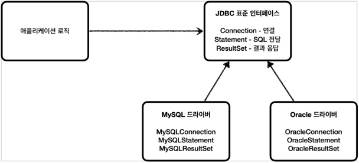

# 💡 2-2 URI & MIME type

* 식별자(identifier)
* URI (Uniform Resource ID)
* URL -> Locator (리소스 위치) - 위치 변경에 취약
* URN -> Name (유니크한 이름)
* MIME Type (Content Type)
  * text/plain , text/html 등등..

### ✅ URI란?

<figure><figcaption></figcaption></figure>

* URI는 Uniform Resource Identifier 즉 통합 자원 식별자의 줄임말이다.
* URI는 인터넷의 자원을 식별할 수 있는 문자열을 의미한다.
* 그 중, URL이라는 URN이라는 하위 개념을 만들어서 특별히 어떤 표준을 지켜서 자원을 식별하는 것이다.

### ✅ URL이란?

<figure><figcaption></figcaption></figure>

* URL은 Uniform Resource Locator의 줄임말이다.
* URL은 네트워크 상에서 웹페이지, 이미지, 동영상 등의 파일이 위치한 정보를 나타낸다.
* URL은 웹 상의 주소를 나타내는 문자열이기 때문에 더 효율적으로 리소스에 접근하기 위한 방법론들이 생겼는데 REST API도 그 중 하나이다.

### ✅ URN이란?

* URN은 Uniform Resource Name의 줄임말이다.
* URI의 표준 포맷 중 하나로, 이름으로 리소스를 특정하는 URI이다.
* URN은 리소스를 영구적이고 유일하게 식별 할 수 있는 URI이다.

### ✅ URL / URN 차이점

* URL은 어떻게 리소스를 얻을 것이고 어디에서 가져와야하는지 명시하는 URI이다.
* URN은 리소스를 어떻게 접근할 것인지 명시하지 않고 경로와 리소스 자체를 특정하는 것을 목표로하는 URI이다.

### ✅ MIME TYPE

